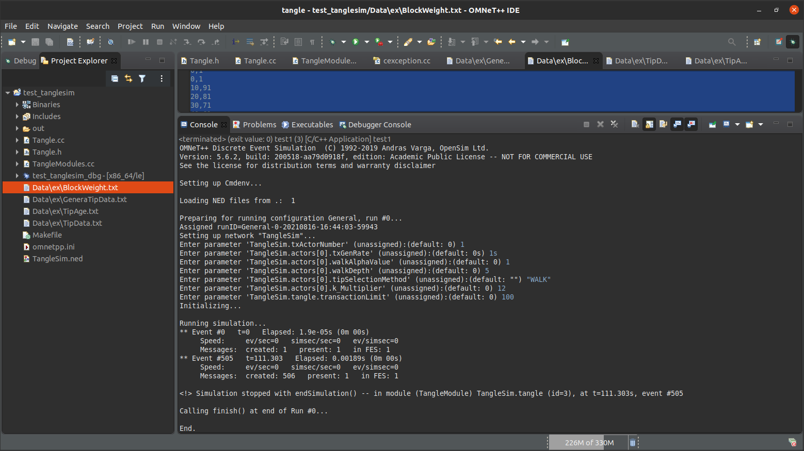

# Implementasi dan perbandingan TSA (Algoritma Pemilihan Tips) yang berbeda untuk cryptocurrency IOTA
**Note:** diterjemahkan dari sumber asli penulis di https://github.com/T-amairi/Implementation-of-different-TSA-for-IOTA

- IOTA : www.descryptions.com/Iota.pdf
- G-IOTA : https://ieeexplore.ieee.org/document/8845163
- E-IOTA : https://ieeexplore.ieee.org/document/9223294

Proyek ini didasarkan pada git berikut: https://github.com/richardg93/TangleSim dan karena itu memerlukan perangkat lunak OMNeT ++ untuk mensimulasikan Tangle (lihat https://blog.iota.org/the-tangle-an-illustrated-introduction-4d5eae6fe8d4/). 
Beberapa perubahan telah dilakukan untuk itu (tampilan dengan graphviz, file log, benchmark, implementasi dari TSA yang berbeda).

File Tangle.cc, Tangle.h, TangleModules.cc, TangleSim.ned dan omnetpp.ini adalah file sumber yang diperlukan untuk dapat mensimulasikan TSA yang berbeda dengan OMNeT ++.
Folder data berisi file log, statistik kinerja untuk skrip TSA, .dot display (graphviz) dan Python yang berbeda:
- Stats.py memungkinkan Anda untuk rata-rata kinerja TSA melalui file log di folder log.
- Notebook TSAResult.ipynb memungkinkan Anda untuk melakukan barplot untuk membandingkan kinerja TSA yang berbeda.
- TangleGen.py memungkinkan Anda untuk menampilkan Tangle berkode warna di folder im. Ini menggunakan file log dari folder Traking.
RTracking berisi file log dari git referensi.

Untuk detail selengkapnya lihat laporan: https://github.com/T-amairi/Implementation-of-different-TSA-for-IOTA/blob/main/Compte%20Rendu.pdf.
**Note: Belum di UJI COBA**

# TangleSim
**Note:** https://github.com/richardg93/TangleSim
Omnet++ simulation of a directed acyclic graph

This a simulation model that can be used to simulate a network of individual nodes, issuing transactions to construct (via various tip selection methods) a Tangle.

The Tangle is a Directed Acyclic Graph (DAG) which is not a novel structure. However, using a DAG where nodes are individual transactions is a novel use, and introduced to us by the IOTA foundation, see: https://www.iota.org/research/academic-papers .

I produced this model as part of my masters thesis while at Cardiff University, and is part of - an as of yet unpublished - paper to appear at marble2019, see: https://www.marble2019.org/ .

The omnet++ and pure c++ classes are separate yet fairly intertwined. The omnet++ modules should really privately inherit from the pure c++ classes, to avoid some of the hacky reference passing around. 

It is possible to use the pure c++ classes with another event simulator/framework, but as time has gone on, in this version they are more intertwined than ever.

Feel free to drop me a message if you want to contribute/branch/pull etc, or more likely if you want to know how it works - happy to help either way.

**Testing** Uji coba program pada TangleSim https://github.com/richardg93/TangleSim

## INPUT PROGRAM "Testing"
```bash
Preparing for running configuration General, run #0...
Assigned runID=General-0-20210816-16:44:03-59943
Setting up network "TangleSim"...
Enter parameter 'TangleSim.txActorNumber' (unassigned):(default: 0) 1
Enter parameter 'TangleSim.actors[0].txGenRate' (unassigned):(default: 0s) 1s
Enter parameter 'TangleSim.actors[0].walkAlphaValue' (unassigned):(default: 0) 1
Enter parameter 'TangleSim.actors[0].walkDepth' (unassigned):(default: 0) 5
Enter parameter 'TangleSim.actors[0].tipSelectionMethod' (unassigned):(default: "") "WALK"
Enter parameter 'TangleSim.actors[0].k_Multiplier' (unassigned):(default: 0) 12
Enter parameter 'TangleSim.tangle.transactionLimit' (unassigned):(default: 0) 100
Initializing...

Running simulation...
** Event #0   t=0   Elapsed: 1.9e-05s (0m 00s)
     Speed:     ev/sec=0   simsec/sec=0   ev/simsec=0
     Messages:  created: 1   present: 1   in FES: 1
** Event #505   t=111.303   Elapsed: 0.00189s (0m 00s)
     Speed:     ev/sec=0   simsec/sec=0   ev/simsec=0
     Messages:  created: 506   present: 1   in FES: 1
````

## OUTPUT TipAge
```bash
TxNumber,Tip Age,First Approval Time,Attach Time,Direct Approvers
0,-1.002,0,1.002,0
1,1.102,3.206,2.104,2
2,1.102,4.308,3.206,2
3,1.102,5.41,4.308,2
4,1.102,6.512,5.41,2
5,1.102,7.614,6.512,2
6,1.102,8.716,7.614,2
7,1.102,9.818,8.716,2
8,1.102,10.92,9.818,2
9,1.102,12.022,10.92,2
10,1.102,13.124,12.022,2
11,1.102,14.226,13.124,2
12,1.102,15.328,14.226,2
13,1.102,16.43,15.328,2
14,1.102,17.532,16.43,2
15,1.102,18.634,17.532,2
16,1.102,19.736,18.634,2
17,1.102,20.838,19.736,2
18,1.102,21.94,20.838,2
19,1.102,23.042,21.94,2
20,1.102,24.144,23.042,2
21,1.102,25.246,24.144,2
22,1.102,26.348,25.246,2
23,1.102,27.45,26.348,2
24,1.102,28.552,27.45,2
25,1.102,29.654,28.552,2
26,1.102,30.756,29.654,2
27,1.102,31.858,30.756,2
28,1.102,32.96,31.858,2
29,1.102,34.062,32.96,2
30,1.102,35.164,34.062,2
31,1.102,36.266,35.164,2
32,1.102,37.368,36.266,2
33,1.102,38.47,37.368,2
34,1.102,39.572,38.47,2
35,1.102,40.674,39.572,2
36,1.102,41.776,40.674,2
37,1.102,42.878,41.776,2
38,1.102,43.98,42.878,2
39,1.102,45.082,43.98,2
40,1.102,46.184,45.082,2
41,1.102,47.286,46.184,2
42,1.102,48.388,47.286,2
43,1.102,49.49,48.388,2
44,1.102,50.592,49.49,2
45,1.102,51.694,50.592,2
46,1.102,52.796,51.694,2
47,1.102,53.898,52.796,2
48,1.102,55,53.898,2
49,1.102,56.102,55,2
50,1.102,57.204,56.102,2
51,1.102,58.306,57.204,2
52,1.102,59.408,58.306,2
53,1.102,60.51,59.408,2
54,1.102,61.612,60.51,2
55,1.102,62.714,61.612,2
56,1.102,63.816,62.714,2
57,1.102,64.918,63.816,2
58,1.102,66.02,64.918,2
59,1.102,67.122,66.02,2
60,1.102,68.224,67.122,2
61,1.102,69.326,68.224,2
62,1.102,70.428,69.326,2
63,1.102,71.53,70.428,2
64,1.102,72.632,71.53,2
65,1.102,73.734,72.632,2
66,1.102,74.836,73.734,2
67,1.102,75.938,74.836,2
68,1.102,77.04,75.938,2
69,1.102,78.142,77.04,2
70,1.102,79.244,78.142,2
71,1.102,80.346,79.244,2
72,1.102,81.448,80.346,2
73,1.102,82.55,81.448,2
74,1.102,83.652,82.55,2
75,1.102,84.754,83.652,2
76,1.102,85.856,84.754,2
77,1.102,86.958,85.856,2
78,1.102,88.06,86.958,2
79,1.102,89.162,88.06,2
80,1.102,90.264,89.162,2
81,1.102,91.366,90.264,2
82,1.102,92.468,91.366,2
83,1.102,93.57,92.468,2
84,1.102,94.672,93.57,2
85,1.102,95.774,94.672,2
86,1.102,96.876,95.774,2
87,1.102,97.978,96.876,2
88,1.102,99.08,97.978,2
89,1.102,100.182,99.08,2
90,1.102,101.284,100.182,2
91,1.102,102.386,101.284,2
92,1.102,103.488,102.386,2
93,1.102,104.59,103.488,2
94,1.102,105.692,104.59,2
95,1.102,106.794,105.692,2
96,1.102,107.896,106.794,2
97,1.102,108.998,107.896,2
98,1.102,110.1,108.998,2
99,1.102,111.202,110.1,2
100,-111.202,0,111.202,0
```
## OUTPUT TIP DATA
```bash
TxNumber,Tips seen,Tips after
0,1,1
1,1,1
2,1,1
3,1,1
4,1,1
5,1,1
6,1,1
7,1,1
8,1,1
9,1,1
10,1,1
11,1,1
12,1,1
13,1,1
14,1,1
15,1,1
16,1,1
17,1,1
18,1,1
19,1,1
20,1,1
21,1,1
22,1,1
23,1,1
24,1,1
25,1,1
26,1,1
27,1,1
28,1,1
29,1,1
30,1,1
31,1,1
32,1,1
33,1,1
34,1,1
35,1,1
36,1,1
37,1,1
38,1,1
39,1,1
40,1,1
41,1,1
42,1,1
43,1,1
44,1,1
45,1,1
46,1,1
47,1,1
48,1,1
49,1,1
50,1,1
51,1,1
52,1,1
53,1,1
54,1,1
55,1,1
56,1,1
57,1,1
58,1,1
59,1,1
60,1,1
61,1,1
62,1,1
63,1,1
64,1,1
65,1,1
66,1,1
67,1,1
68,1,1
69,1,1
70,1,1
71,1,1
72,1,1
73,1,1
74,1,1
75,1,1
76,1,1
77,1,1
78,1,1
79,1,1
80,1,1
81,1,1
82,1,1
83,1,1
84,1,1
85,1,1
86,1,1
87,1,1
88,1,1
89,1,1
90,1,1
91,1,1
92,1,1
93,1,1
94,1,1
95,1,1
96,1,1
97,1,1
98,1,1
99,1,1
100,1,1
````
## OUTPUT BLOCK WEIGHT
```bash
TxNumber,Weight
0,1
0,1
10,91
20,81
30,71
40,61
50,51
60,41
70,31
80,21
90,11
100,1
````
